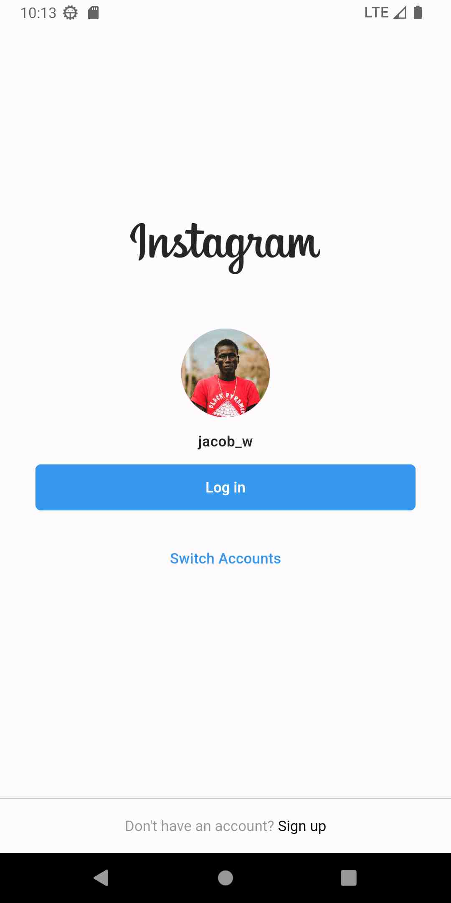
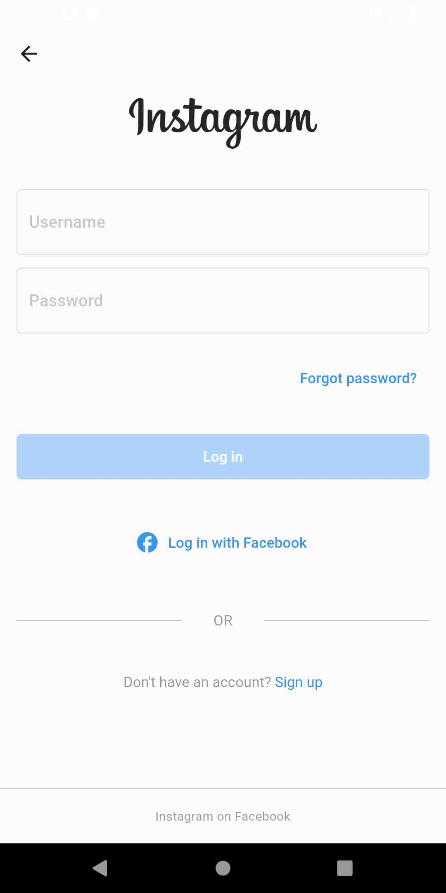
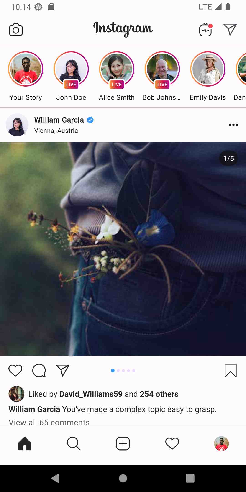

# Flutter Instagram Clone

Clone of Instagram using Flutter framework.

## 📱 Screenshots

   

## 🌐 Live web preview

[Click here to view live preview of the project ](https://antonyaiwin.github.io/flutter_instagram_clone/)

## 🛠 Resources

##### Design and icons are from figma project :

https://www.figma.com/file/zrxf9kOSFDX6cwdErLvFYh/Instagram-UI-Screens-(Community)?type=design&t=QfQIYR5QZw9kukH3-6

##### Images are from [Pexels.com](https://www.pexels.com/)
